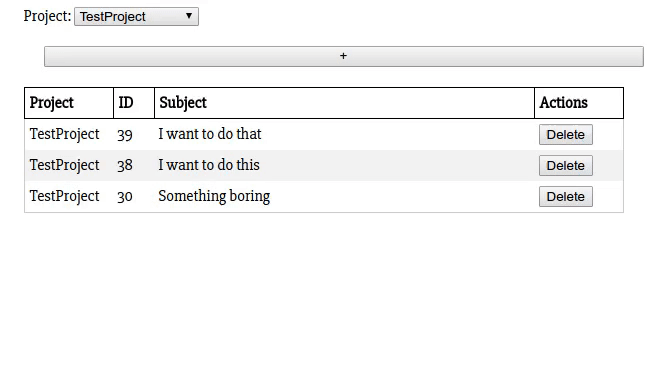

# redmine reactive

This project is intended as a simple UI for Redmine.

## Configuration

You need to create a file named conf.txt.

On the first line it should contain the url of you redmine installation, on the second your API key
